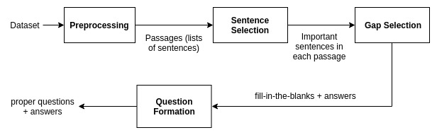
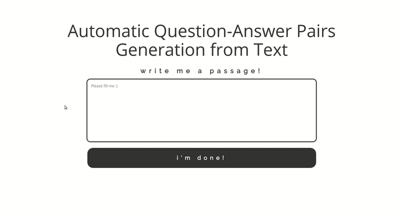

# Automatic Question-Answer Pairs Generation from Text

## Members

1. [Holy Lovenia](https://github.com/holylovenia)

2. [Agus Gunawan](https://github.com/agusgun)

3. [Felix Limanta](https://github.com/felixlimanta)

## English Paper

We have a technical report that explains our question-answer generation system [here](https://www.researchgate.net/publication/328916588_Automatic_Question-Answer_Pairs_Generation_from_Text).

## Architecture in overview

We propose an approach which is generally based on the framework of an ongoing work by [A. Sarvaiya](https://software.intel.com/en-us/articles/using-natural-language-processing-for-smart-question-generation). Formally, given a passage , question-answer generation (**QAG**) system retrieves the most important sentence  from . Then, **QAG** system produces a set of question-answer pairs , where each generated  can be found in , and its pair  is the interrogative version of  or a clause  from a set of clauses  in , without  in it. As shown in the figure below, here are four main modules  in our **QAG** system.

1. **Preprocessing**, which cleans the input passage  from unnecessary characters and shapes it into the desirable form (list of sentences).

2. **Sentence Selection**, which picks top- most important sentences  given . The text summarization method used can be chosen between TextRank, multi-word phrase extraction (MWPE), and latent semantic analysis (LSA). The chosen method ranks the sentences in P and selects the top- highest ranked sentences as the output.

3. **Gap Selection**, which selects phrases in  that can be used as answers  based on constituent tree from syntactic parser and named entity recognition (NER).

4. **Question Formation**, which creates the interrogative version of  or  in  without  to make a question  for each answer in . The final output of this module is question-answer pairs  related to .

## Result

1. Demonstration with [Jupyter Notebook](https://github.com/holylovenia/question-answer-generation/blob/master/QuestionGeneration/QG_Final.ipynb)

2. Source code for the web version is in [this GitHub repository](https://github.com/agusgun/qag-web). Check it out!

## Installation

1. Export '$STANFORD_PARSER' environment variable using lib path using command `EXPORT STANFORD_PARSER=<ABSOLUTE_PATH>` e.g. `EXPORT STANFORD_PARSER=/home/anonymous/question-answer-generation/QuestionGeneration/lib`
2. If you want the website version please see the link above
3. If the program stuck after loading the model. It's because the port already used. This happened usually after you already run the program twice or several times. Please kill the process that runs on the port using `lsof -i` find java, kill the proces PID.

